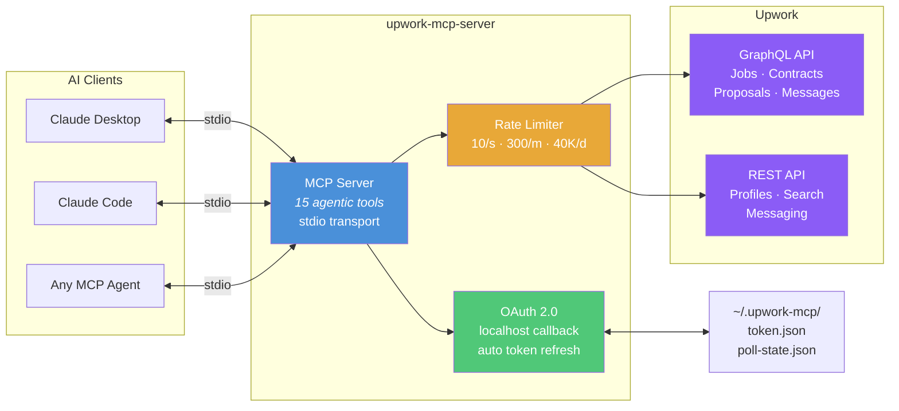
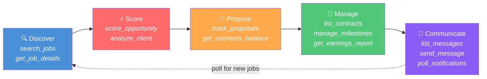
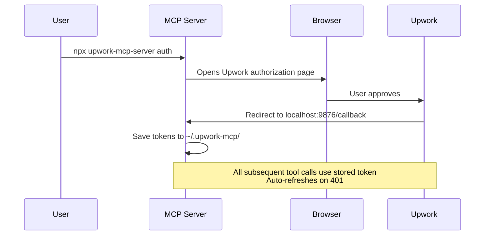

# Upwork MCP Server — Architecture Overview

## How It Works

```mermaid
graph LR
    subgraph "AI Clients"
        CD["Claude Desktop"]
        CC["Claude Code"]
        AG["Any MCP Agent"]
    end

    subgraph "upwork-mcp-server"
        MCP["MCP Server<br/><i>15 agentic tools</i><br/>stdio transport"]
        AUTH["OAuth 2.0<br/>localhost callback<br/>auto token refresh"]
        RATE["Rate Limiter<br/>10/s · 300/m · 40K/d"]
    end

    subgraph "Upwork"
        GQL["GraphQL API<br/>Jobs · Contracts<br/>Proposals · Messages"]
        REST["REST API<br/>Profiles · Search<br/>Messaging"]
    end

    FS["~/.upwork-mcp/<br/>token.json<br/>poll-state.json"]

    CD & CC & AG <-->|"stdio"| MCP
    MCP --> AUTH
    AUTH <--> FS
    MCP --> RATE
    RATE --> GQL & REST

    style MCP fill:#4A90D9,color:#fff
    style AUTH fill:#50C878,color:#fff
    style RATE fill:#E8A838,color:#fff
    style GQL fill:#8B5CF6,color:#fff
    style REST fill:#8B5CF6,color:#fff
```

## The Freelancer Workflow

```mermaid
flowchart LR
    D["🔍 Discover<br/><i>search_jobs</i><br/><i>get_job_details</i>"]
    S["⚡ Score<br/><i>score_opportunity</i><br/><i>analyze_client</i>"]
    P["📝 Propose<br/><i>track_proposals</i><br/><i>get_connects_balance</i>"]
    M["💼 Manage<br/><i>list_contracts</i><br/><i>manage_milestones</i><br/><i>get_earnings_report</i>"]
    C["💬 Communicate<br/><i>list_messages</i><br/><i>send_message</i><br/><i>poll_notifications</i>"]

    D --> S --> P --> M --> C
    C -.->|"poll for new jobs"| D

    style D fill:#4A90D9,color:#fff
    style S fill:#FF6B6B,color:#fff
    style P fill:#FFA94D,color:#fff
    style M fill:#50C878,color:#fff
    style C fill:#8B5CF6,color:#fff
```

## Auth Flow

```mermaid
sequenceDiagram
    participant User
    participant Server as MCP Server
    participant Browser
    participant Upwork

    User->>Server: npx upwork-mcp-server auth
    Server->>Browser: Opens Upwork authorization page
    Browser->>Upwork: User approves
    Upwork->>Server: Redirect to localhost:9876/callback
    Server->>Server: Save tokens to ~/.upwork-mcp/
    Note over Server,Upwork: All subsequent tool calls use stored token<br/>Auto-refreshes on 401
```
